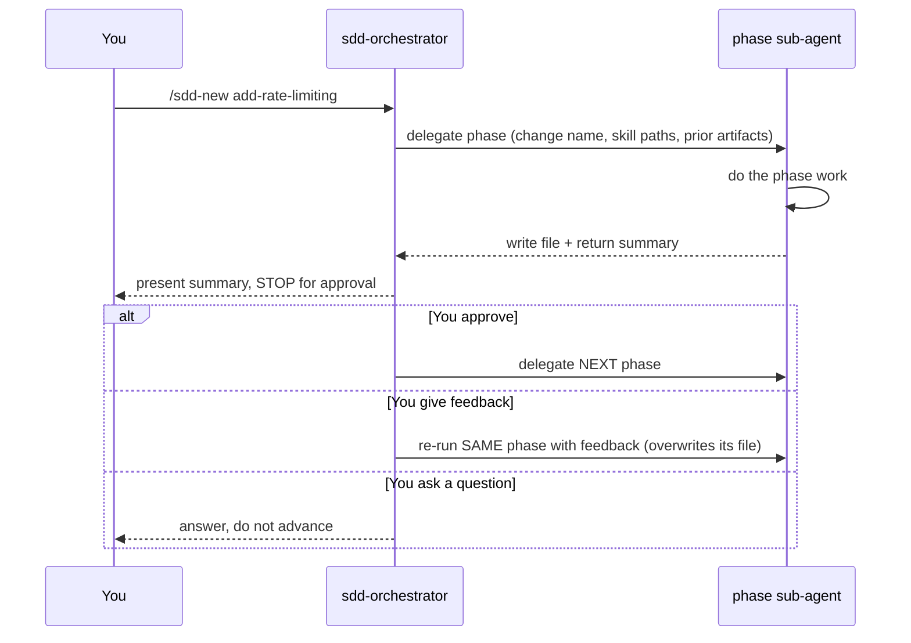
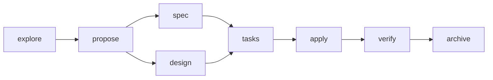

# The Architecture

The harness is built on four architectural principles. Each one is a deliberate engineering
decision that reduces entropy — and together they are what makes AI-assisted work durable,
auditable, and safe to hand off. SDD is one workflow that *applies* these principles; they are not
specific to it.

If [`overview.md`](overview.md) is the *why*, this is the *how it's built*.

The four principles:

1. **The files ARE the state** — workflow state can live in Git-tracked files, not a conversation.
2. **Documents are contracts** — each artifact bounds what the next phase may do.
3. **Agents are engineering boundaries** — specialization is enforced by permissions, not politeness.
4. **Gates reduce uncertainty** — approval points narrow the solution space, not just review output.

A useful name for the whole thing: an **AI engineering runtime** — an orchestration layer that
executes an engineering workflow, with the four principles as its execution model.

---

## Principle 1 — The files ARE the state

This is the defining architectural decision of the project: **workflow state is stored as ordinary,
Git-tracked Markdown files — not as conversation history, and not in a hidden database.**

Every phase writes a file into `openspec/changes/<change-name>/`. Because each change is just its
own folder, you can have several in flight at once — the state of each is entirely self-contained:

```
openspec/changes/
├── add-rate-limiting/       <- one change in progress
│   ├── exploration.md
│   ├── proposal.md
│   ├── spec.md
│   ├── design.md
│   ├── tasks.md
│   └── verify-report.md
├── fix-login-redirect/      <- another, at a different phase
│   ├── proposal.md
│   └── spec.md
└── migrate-auth-provider/   <- a third, just started
    └── exploration.md
```

Start, stop, resume, rework — for any change — all of it reduces to a single question: *which files
exist?* There is no external state to sync, no session to keep alive. That one decision buys seven
properties at once:

| Property | Because the state is a file… |
| --- | --- |
| **Resumability** | Close the session anytime; the `.md` files persist. Pick up exactly where you stopped. |
| **Reproducibility** | The same artifacts drive the same next phase — no dependence on a warm chat context. |
| **Auditability** | `git diff` shows how a decision changed and who approved it. |
| **Collaboration** | A teammate reads the files to understand in-flight work, no replay needed. |
| **Traceability** | Every requirement, decision, and task is written down and linked. |
| **Portability** | Cross-machine, cross-person handoff works — commit the folder, they pull it. |
| **Deterministic handoffs** | The next phase (or person) receives an explicit contract, not a vibe. |

**Replacing conversational state with explicit artifacts is the deliberate move.** A chat is
ephemeral, single-owner, and un-diffable. A file is durable, shareable, and reviewable. That swap is
what turns "I had a session with an AI" into "we have an engineering record."

---

## Principle 2 — Documents are contracts

The artifacts are not reports produced *after* the work. **Each one is a contract that governs what
the next phase is allowed to do.** This is what makes the workflow rigorous rather than merely
organized.

Read the phase chain as a chain of contracts, each narrowing the solution space further:

| Artifact | The contract it sets |
| --- | --- |
| **exploration.md** | Narrows the *possible approaches* — here are the options and the recommended one. |
| **proposal.md** | Defines *scope* — what's in, what's out, the approach we're committing to. |
| **spec.md** | Defines *required behavior* — what MUST be true after the change (WHAT, not HOW). |
| **design.md** | Defines *implementation boundaries* — architecture, components, decisions. |
| **tasks.md** | Defines *execution* — ordered, shippable units, each linked back to a spec requirement. |
| **verify-report.md** | Validates the *agreed contract* — did the implementation meet the spec? |

Each phase **reads the previous contract and writes the next.** The design cannot invent behavior
the spec didn't require; the tasks trace back to spec requirements; verify checks the code against
the spec, not against a fresh opinion. The solution space gets smaller and better-defined at every
step — which is exactly why the output comes out straighter, with fewer hallucinations. The model
isn't smarter at each step; **its problem is smaller and its contract is explicit.**

---

## Principle 3 — Agents are engineering boundaries

The harness delegates each phase to a **specialized sub-agent**. Specialization here is not a
matter of giving each agent a different prompt — it is **enforced through five real boundaries**:

- **Permissions** — what the agent is physically allowed to do (e.g. edit files or not).
- **Tools** — which tools it can call at all.
- **Inputs** — the artifacts it reads.
- **Outputs** — the single artifact it writes.
- **Responsibilities** — the one job it's defined to do.

The important idea: **the system separates engineering concerns, it doesn't just assign roles.**
These are architectural *guarantees*, verifiable in the agent definitions — not conventions the
model is asked to honor.

The clearest examples, straight from the agent frontmatter:

| Agent | Guarantee | How it's enforced |
| --- | --- | --- |
| `sdd-explore` | **Cannot modify source.** Investigation only. | `tools.edit: false`, `permission.edit: deny` |
| `sdd-verify` | **Cannot modify source.** It checks; it can't "fix" to make a check pass. | `tools.edit: false`, `permission.edit: deny` |
| `sdd-apply` | **The only phase that writes code.** | `tools.edit: true`, `permission.edit: allow` |

`explore` physically cannot edit; `verify` physically cannot edit; `apply` is the sole implementer.
Because these are permission-level facts, a drifting model *cannot* cross the boundary even if it
"wants" to. The orchestrator itself is bounded the same way — its `task` permission whitelists
exactly which sub-agents it may launch and denies the rest.

The payoff compounds: each agent stays focused on a small surface, so there's less room for a single
over-loaded agent to drift or hallucinate — and the orchestrator stays a **thin coordinator**, never
dragged into the details, keeping its own context clean.

Because each agent is its own file, specialization extends to **which model it runs on** — you can
tune cost vs. capability per phase. See [`reference/models.md`](../reference/models.md).

---

## Principle 4 — Gates reduce uncertainty

Between every phase, the orchestrator **stops and waits for a human.** It's tempting to read this as
"a review step." It's more than that. **Approval gates are the mechanism that reduces uncertainty
and constrains the AI's search space.** Each gate:

- **Reduces branching.** Once you approve the proposal, the design isn't exploring five possible
  scopes anymore — it's working within one.
- **Locks in decisions.** An approved artifact is settled. The model won't silently re-litigate it
  three phases later.
- **Prevents amplification of bad assumptions.** A wrong assumption caught at the proposal gate
  costs one re-run; the same assumption caught after `apply` has already propagated through design,
  tasks, and code.
- **Progressively constrains the search space.** Every approval removes possibilities the downstream
  phases would otherwise have to consider.



So the gate isn't bureaucracy — it's how uncertainty gets removed from the system one decision at a
time. And because a human consents to each artifact before the next phase builds on it, you get two
things freeform chat can't offer: **errors caught per-step** (not discovered at the end atop a bad
assumption) and **explicit accountability** (a person signed off on each contract).

---

## SDD: the first workflow on top of the architecture

Everything above is workflow-agnostic. SDD is the concrete workflow shipped here — eight phases,
each a specialized agent applying the four principles:



`spec` and `design` depend only on `propose`, so they can run in either order; everything else is
sequential. SDD is simply the well-worn engineering process encoded first.

**The same harness could encode a very different methodology** — a different set of phases, agents,
and contracts. The four principles don't assume SDD; they assume *any* process worth making
explicit. Some directions this architecture could take:

| Methodology | What the phases / artifacts might be |
| --- | --- |
| **Shape Up** | `pitch → shaping → betting → build`, with the shaped pitch and its appetite/boundaries as the governing contract. |
| **Scrum** | `backlog-refinement → sprint-planning → implementation → review → retro`, artifacts as story specs and increment reports. |
| **Event Storming** | `big-picture → process-modeling → software-design`, artifacts capturing domain events, commands, and aggregates. |
| **Domain-Driven Design** | `context-mapping → ubiquitous-language → aggregate-design → implementation`, each artifact a bounded-context contract. |
| **ADR-first development** | Every change opens with an Architecture Decision Record; the ADR is the contract that later phases must honor. |
| **Security reviews** | `threat-model → controls-spec → implementation → security-verify`, with a read-only review agent that cannot edit code (Principle 3). |
| **FRC / RFC workflows** | `draft → review → accepted → implement`, the accepted RFC serving as the frozen contract for downstream work. |

And the architecture isn't even specific to software. The four principles describe *any* disciplined
creative or knowledge process — narrow the space step by step, hand off explicit artifacts, review at
gates, keep state in files. The same harness could carry work owned by entirely different roles:

| Methodology | Role / domain | Phases → artifacts (the contract) |
| --- | --- | --- |
| **Design Thinking (Double Diamond)** | Product & UX design | `empathize → define → ideate → prototype → test`, each artifact a research synthesis or validated concept. |
| **Brand identity development** | Graphic / brand design | `brief → moodboard → concepts → design-system → handoff`, the approved brief and design tokens as the governing contract. |
| **Editorial / content pipeline** | Writers, content teams | `outline → draft → edit → fact-check → publish`, with a read-only fact-check agent that cannot alter the draft (Principle 3). |
| **Instructional design (ADDIE)** | Learning / curriculum | `analyze → design → develop → implement → evaluate`, each phase's document bounding the next. |
| **Grant / proposal writing** | Research, non-profits | `concept-note → scope → budget → narrative → compliance-review`, the review gate blocking submission on unmet criteria. |
| **Legal contract drafting** | Legal | `intake → term-sheet → draft → redline-review → execution`, the approved term sheet as the frozen contract. |
| **Marketing campaign planning** | Marketing | `brief → strategy → creative → media-plan → post-mortem`, artifacts as the approved brief and channel plan. |
| **Film / video pre-production** | Production | `treatment → script → storyboard → shot-list → shoot`, each locked document constraining the next. |
| **Scientific method** | Research | `hypothesis → method → experiment → analysis → peer-review`, the read-only review stage validating the agreed method. |
| **Architecture / AEC design** | Built environment | `programming → schematic → design-development → construction-docs`, each stage a signed-off contract for the next. |

These aren't shipped — they're illustrations. The point is that **the harness is methodology-agnostic
(and even domain-agnostic) infrastructure**; SDD is one methodology, encoded first, for one role.

For the phase-by-phase mechanics and a full worked example, see
[`guides/workflow.md`](../guides/workflow.md).

---

## The supporting machinery

Two pieces of plumbing make the principles run deterministically. They're implementation detail —
here for completeness, not part of the core argument.

### The skill registry (deterministic expertise handoff)

Skills are reusable "how-to" playbooks. `skill-registry.sh` scans the skill folders and generates
`.sdd-workflow/.skill-registry.md`, an index the orchestrator reads at session start. When it
delegates a phase, it passes the sub-agent the **exact `SKILL.md` path(s)** to read — so the agent
starts pre-loaded instead of hunting for its own instructions. Each agent reports back
`skill_resolution: paths-injected` (got the exact paths) or a fallback value — a **verifiable
handoff signal**, not a guess. This is Principle 2 applied to expertise: the orchestrator resolves
"which knowledge, exact path" once, so every handoff is explicit.

### Riding modern agent primitives

The harness is a disciplined arrangement of primitives that modern agents (OpenCode, Claude Code)
already expose: **slash commands, sub-agents, skills, tools, and per-agent permissions.** Nothing
here is proprietary magic — the workflow is plain Markdown agent/skill/command files plus a couple
of shell scripts. Lock-in risk is low: if the tooling evolves or a better pattern appears, the AI
itself can migrate the harness, because the logic isn't trapped in a binary format.

---

## In one paragraph

A workflow harness that applies established software-engineering principles to AI-assisted
development by **replacing conversational state with explicit artifacts** (Principle 1), **treating
every artifact as a contract for the next phase** (Principle 2), **orchestrating specialized agents
whose boundaries are enforced by permissions** (Principle 3), and **keeping a human at approval
gates that progressively narrow the solution space** (Principle 4). SDD is the first concrete
workflow implemented on that architecture — not the architecture itself.
