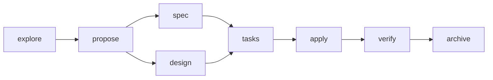

# What This Project Is

**This is a workflow harness for AI-assisted software engineering.** It puts a real engineering
process around an AI agent — so building software with AI stops being "roll the dice on a big
prompt and hope," and becomes a sequence of bounded, reviewable steps that a human stays in control
of the whole way.

Spec-Driven Development (SDD) is **just a workflow encoded in that harness** — a concrete,
useful example. But the product is the harness: an orchestrator, specialized agents, file-based
artifacts, approval gates, and per-agent permissions. That architecture could carry many
engineering methodologies. SDD is just the one shipped here.

> If you remember one sentence: **AI should not replace the engineering process — it should operate
> inside one.** This project is the process.

---

## The problem it solves

The bottleneck in AI-assisted development is **not** the model's ability to write code. Modern
models write good code. The bottleneck is **entropy** — the way an open-ended chat degrades as the
work gets bigger:

- **Conversations drift.** Over a long thread, the model loses the plot, re-litigates settled
  decisions, or quietly changes scope.
- **Context becomes implicit.** What you agreed to is scattered across the scroll-back, never
  written down as a fixed contract.
- **Decisions get lost.** "Why did we choose approach B?" lives in a message 200 lines up, if it
  survives at all.
- **The AI keeps reconstructing intent.** Every turn, it re-derives what you want from the whole
  conversation — and each time it can reconstruct something *slightly different*, drifting from the
  goal.
- **Hallucinations come from missing structure**, not missing intelligence. With no fixed record of
  "what we decided," the model invents APIs, file paths, and requirements to fill the gap.

The failure mode everyone recognizes: you throw a big prompt at the AI, it does something plausible,
you spend the next hour in a fix-it-again loop, and you're never quite sure the result matches what
you actually wanted. That loop is entropy. **The harness exists to reduce entropy by progressively
narrowing the solution space** — one bounded step at a time.

The phases you'll see later are a *consequence* of that goal, not the point of it.

---

## The core bet: workflow over prompting

The industry has been trying to fix AI coding by making prompts bigger and context windows longer.
This project makes the opposite bet:

- **Better workflows beat bigger prompts.** Structure around the model outperforms cleverness inside
  a single prompt.
- **AI performs better when each step has one narrow job.** A model asked to "explore" does that
  well; a model asked to "explore and design and implement all at once" drifts.
- **Constraints improve output more reliably than context.** Telling the model what it *cannot* do,
  and what it must produce, beats handing it more to read.
- **The engineering process becomes part of the solution** — not a document you write once and
  abandon.

This is the state-of-the-art argument, and it's a software-engineering one, not a prompt-engineering
one. We spent decades learning that discipline — explicit contracts, separation of concerns,
review gates, auditability — produces better software. Those lessons don't stop applying because the
author is an AI. **The harness is how you apply them.**

---

## Why this stays valuable as models improve

A fair question: won't better models make all of this unnecessary?

No — because they solve a *different* problem:

- **Better models reduce implementation mistakes** — fewer bugs, better code, cleaner syntax.
- **Better workflows reduce engineering mistakes** — wrong scope, lost decisions, unverifiable
  claims, work nobody can hand off or audit.

A smarter model still drifts over a long conversation, still leaves intent implicit, still can't
hand its context to your teammate. Those are properties of the *process*, not the model. A workflow
that fixes them keeps paying off no matter how good the model gets. That makes this approach more
durable than any prompt-specific trick, which a model upgrade can obsolete overnight.

---

## How it's different from what you're probably doing

| Approach | What it optimizes | What it's missing |
| --- | --- | --- |
| **One-shot prompting** | Speed on small tasks | No memory, no verification, no trail — great until the task is non-trivial. |
| **Long conversational coding** | Flexibility | Entropy: drift, implicit context, lost decisions, constant re-steering. |
| **Prompt libraries** | Reuse of good phrasings | Still one big prompt — no workflow state, no phase boundaries, no gates. |
| **Planner → coder → reviewer agents** | Some separation of roles | State lives in the conversation between agents; no durable artifacts, no human gates, no enforced boundaries. |
| **This harness** | **Durable workflow state + explicit engineering contracts** | Not for throwaway one-liners (that's what plain chat is for). |

The distinguishing characteristics are **durable, git-tracked workflow state** and **explicit
contracts between phases** — not a cleverer prompt or a bigger agent swarm.

---

## The shape of it (one look)

The harness runs phases. Each phase is a specialized agent with a narrow job; between phases, a
human approves. For SDD, the phases are:

You don't write a spec first. **You just talk — in order.** Each step captures its outcome as a
file, so the next step (and your teammate, and your future self) reads a contract instead of
replaying a chat.

- Want the architecture behind this — the four principles that make it work? See
  [`concepts/architecture.md`](architecture.md).
- Want to run it? See [`guides/install.md`](../guides/install.md) and
  [`guides/workflow.md`](../guides/workflow.md).

---

## When to reach for it — and when not to

| Situation | Use |
| --- | --- |
| Trivial edit, quick question, throwaway exploration | Plain freeform chat |
| Non-trivial, multi-step change | The harness |
| Work a teammate will review, take over, or need to understand | The harness |
| Anything you want an auditable trail for | The harness |
| Fully unattended, hands-off automation | Neither — this is human-guided by design |

**Rule of thumb: freeform for the small and disposable; the harness for the non-trivial and
team-visible.**

Honest trade-offs: it adds ceremony to trivial changes, it needs your attention at each gate (not
fire-and-forget), and reworking an early phase doesn't auto-invalidate later ones — you re-run them
yourself. Details in [`guides/workflow.md`](../guides/workflow.md).

---

## The philosophy, restated

Freeform prompting asks the human to carry the engineering process in their head and re-transmit it
every turn. This harness moves that burden into the workflow itself: the phases carry the structure,
the files carry the state, the gates carry the decisions. **You review bounded deliverables instead
of continuously steering a conversation** — which is the difference between doing engineering and
supervising a slot machine.

AI should not replace the engineering process. AI should operate inside one.
