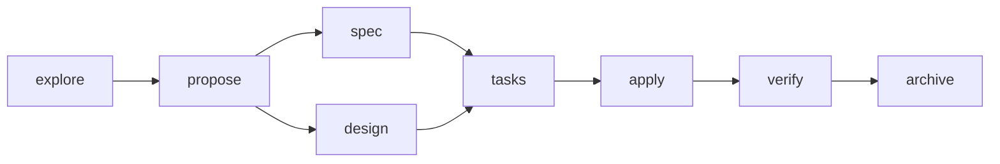
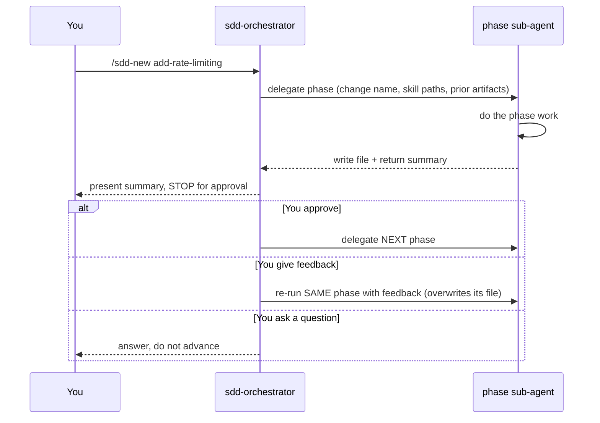

# Why an AI Workflow Harness — An Overview

*A short explainer for teammates: what this project is, and why wrapping an AI agent in a
structured workflow beats using AI as a "chat that codes" — even a chat with skills and tools.*

For the hands-on details, see [`workflow.md`](workflow.md) (worked example) and
[`usage.md`](usage.md) (install/attach/detach).

---

## TL;DR

This project is a small, git-clonable **harness** that wraps a modern AI agent (OpenCode or
Claude Code) in a **Spec-Driven Development (SDD)** workflow. Instead of one open-ended chat, work
moves through explicit phases — `explore → propose → spec → design → tasks → apply → verify →
archive` — where an **orchestrator** delegates each phase to a focused sub-agent, writes a document
for that phase, and **stops for your approval before continuing**.

The result: the AI does more useful work with less drift, every step leaves a paper trail, and a
human stays in control of direction the whole way.

---

## The problem with "AI as a chat that codes"

A raw chat — even one boosted with tools and skills — has real failure modes on non-trivial work:

- **It drifts.** Over a long conversation, the model loses the thread, re-litigates settled
  decisions, or quietly changes scope.
- **It hallucinates.** With no fixed contract for "what we agreed," it invents APIs, file paths, or
  requirements.
- **It has no traceability.** The reasoning lives in a scroll-back you can't hand to a teammate or
  diff in git.
- **It's hard to hand off.** There's no self-describing state — just chat history in one person's
  window.

Skills and tools help the AI *do* individual things better, but they don't impose a *shape* on the
work. Shape is what a harness adds.

---

## Why a methodology/harness beats freeform (the core idea)

Here's the counter-intuitive part.

Our industry largely abandoned "rigid" methodologies (heavy up-front specs, phase gates, sign-off
documents) in favor of agile — because that rigor was **bureaucratic and slow for *humans***.
Writing the spec, keeping it in sync, filling the templates: that cost fell on people, and it
wasn't worth it.

But here's the catch: **that content never actually went away.** Using a "chat that codes," you
still have to get across the same things a spec or a design would capture — what you want, what's
in and out, the edge cases, the constraints — except now it's spread across a long conversation.
Nothing has to be formal, and that's fine. The problem is *where* it lives: scattered through the
thread, the AI has to keep re-threading the whole conversation on every turn to reconstruct intent
— and each time it does, it can reconstruct something *different* from what you meant, quietly
diverging from the goal. On top of that you carry a burden the old process never had: constantly
herding the model so it doesn't hallucinate or drift. So freeform doesn't remove the effort — it
just makes it implicit, unstructured, and easy to lose the thread of.

A harness fixes the *where*, not the formality. You can still work in plain, unstructured
language — but instead of one sprawling thread, the conversation is broken into ordered steps, and
each step's outcome is captured so the AI doesn't have to re-derive intent from the whole chat.
**The effort of keeping things coherent moves to the workflow (and the AI)**, and it stops being
overhead: it turns into **guardrails, constraints, and expectations** that steer the model.

> You don't write a spec first. You just talk — in order.

And steering is exactly what AI needs. A "chat who codes" is unbounded; a phased workflow gives the
model, at each step, a narrow job with clear rules on *how to work*. That produces straighter
results with fewer hallucinations and fewer deviations — not because the model got smarter, but
because the problem got smaller and better-defined at every turn.

**SDD is just one instantiation.** The harness pattern — an orchestrator, phased sub-agents,
approval gates, and a document per step — is workflow-agnostic. You could encode a different
methodology the same way. SDD is the simple, concrete case used here.

---

## SDD as the concrete example

Eight phases, each a focused sub-agent. `spec` and `design` depend only on `propose`, so they can
run in either order; everything else is sequential.



Each phase reads the previous phase's document and writes its own. Small requests never enter this
flow — the orchestrator just handles them inline. You opt into the structure ("use sdd") when the
work is big enough to be worth it.

---

## Human-in-the-middle: guided and verified, not autonomous

This is the trait that defines the whole approach: **there is always a human in the middle.**

After a sub-agent finishes a phase and writes its file, the orchestrator presents the summary and
**stops**. It does not advance on its own. You respond with one of:

- **Approval** → the orchestrator commits that output and launches the *next* phase.
- **Feedback** → the orchestrator **re-runs the same phase** with your notes, overwriting that
  phase's file, and stops again. It does not advance.
- **A question** → it answers without advancing or rewriting.



So the process is **human-guided and human-verified, not autonomous**. Every artifact is *consented
to* by a person who guards that both the process and the output are heading the right way. Two
practical consequences:

- **Errors are caught per-step**, not discovered only at the end after the AI built on a bad
  assumption.
- **There's explicit accountability** — a human signed off on each artifact before the next phase
  built on it.

---

## Guided conversations → straighter results

Because each phase has a defined job and the gate is explicit (approve / feedback / question), the
"talk" with the AI stays pointed at the outcome. You're not negotiating scope in a wall of text;
you're reviewing one bounded deliverable at a time and saying *keep going* or *fix this*. Less
back-and-forth, fewer hallucinations, less rework.

---

## Delegation to specialized sub-agents

The orchestrator stays a **thin coordinator**. It doesn't do the phase work itself — it decides
*which* sub-agent runs next and hands off. Each phase sub-agent has a narrow job and, importantly,
**constraints encoded in its definition**, not just its prompt.

For example, the phase agents carry a superset frontmatter with both a `tools:` block and a
`permission:` block. The `explore` and `verify` agents are **read-only** — they have `edit: false`
/ `edit: deny`, so they physically cannot modify source. Explore investigates; verify checks; only
`apply` writes code. That keeps each agent focused and makes the "when to delegate" boundary a real
guardrail rather than a suggestion.

The payoff for the *main* agent: it isn't dragged into every detail, so its context stays clean and
its focus stays high. Specialization reduces the surface area where a single over-loaded agent could
drift or hallucinate.

---

## Documents as the output — and contract — of every step

Every phase writes a Markdown file into `openspec/changes/<change-name>/`:

```
openspec/changes/add-rate-limiting/
├── exploration.md
├── proposal.md
├── spec.md
├── design.md
├── tasks.md
└── verify-report.md
```

**The files ARE the state.** There is no hidden database — start, stop, resume, and rework all
reduce to "which files exist." That gives three things at once:

- **Traceability** — you can `git diff` how a decision changed and see who approved what.
- **Communication to third parties** — a teammate (or your future self) can read the exploration
  and proposal without replaying a chat.
- **A contract for the next step** — the spec constrains the design; the tasks are linked back to
  spec requirements. Each document bounds what the next phase is allowed to do.

---

## Team collaboration via shared artifacts

Because the whole change folder is self-describing and lives in git, a team on the same harness can
**share the artifacts to hand off work**. Commit `openspec/changes/add-rate-limiting/`, a teammate
pulls it and runs `/sdd-continue add-rate-limiting` — they pick up exactly where you stopped.
Cross-machine, cross-person handoff works because there is no external state to sync. It's also how
you *understand what someone else is working on*: read their in-flight documents.

---

## Riding modern agent features

This is only practical because modern agents (OpenCode, Claude Code) expose the right primitives:
**slash commands, sub-agents/agents, skills, tools, and per-agent permissions.** The harness is
essentially a disciplined arrangement of those features — commands to start/continue, agents per
phase, skills for reusable expertise, permissions to constrain each agent.

Lock-in risk is low. The workflow is expressed as plain Markdown agent/skill/command files plus a
couple of shell scripts. If the tooling evolves or a better pattern appears, the AI itself can
migrate the harness — the logic isn't trapped in a proprietary format.

---

## The skill registry: how the orchestrator hands skills to sub-agents

Skills are the reusable "how-to" playbooks agents can pull in. The harness ships a **support skill
library** (PR creation, splitting oversized PRs into chained PRs, work-unit commits, issue creation,
comment writing, doc design, Go testing, and more), each described with a `Trigger:` so the AI knows
when it applies.

To wire this up deterministically, `skill-registry.sh` scans the skill folders and generates
`.sdd-workflow/.skill-registry.md` — an index of `name | scope | trigger/description | path`. The
`sdd-*` phase skills and internal plumbing are **intentionally excluded** (each phase agent already
hard-references its own skill), so the registry indexes the *support* skills.

The mechanism at run time:

1. At **Session Preflight**, the orchestrator reads `.skill-registry.md`.
2. When it delegates a phase, it passes the sub-agent the **exact `SKILL.md` path(s)** to read
   (e.g. `.claude/skills/sdd-apply/SKILL.md`) — the sub-agent starts *pre-loaded* instead of
   searching for its own instructions.
3. Each phase agent reports back `skill_resolution: paths-injected` (it got the exact paths) or
   `none` (it had to fall back). That's a **verifiable handoff signal**, not a guess.

This is the delegation contract made concrete: the orchestrator resolves "which expertise, exact
path" once, so every sub-agent starts on solid footing — fewer hallucinated paths, less wasted
discovery, and a traceable record of whether the handoff held.

> `.skill-registry.md` is generated per install (it's gitignored, not checked in). Run
> `.sdd-workflow/bin/skill-registry.sh` once after wiring, and again whenever you add or rename a
> skill.

---

## Token and cost efficiency

Guided, scoped conversations are also *cheaper*:

- **Less wasted talk.** You review one bounded deliverable per gate instead of a sprawling thread,
  so there's less back-and-forth and far less "clean up the hallucination" churn.
- **Pre-loaded context.** Injecting exact skill paths avoids the sub-agent burning tokens hunting
  for its own instructions.
- **Right-sized models per phase (optional lever).** These agents support a per-agent `model:`
  setting in frontmatter. So you *can* run cheaper/faster models for mechanical phases (e.g.
  scaffolding tasks) and reserve a stronger model for the phases that need it (design, apply).
  Not configured out of the box here — but the harness makes it a one-line change per agent.

---

## How it works in practice (quick tour)

```
/sdd-new add-rate-limiting        # start: explore, then propose (with gates)
/sdd-continue add-rate-limiting   # run the next phase in the chain to resume a previous work
/sdd-status add-rate-limiting     # read-only: which artifacts exist, what's next
/sdd-ff add-rate-limiting         # fast-forward planning phases (stops before apply)
```

(In Claude Code, phrase these as requests to the `sdd-orchestrator` agent.)

- **Approve / feedback / question** at each gate, as described above.
- **Stop anytime** — just close the session; the `.md` files persist. `apply` even marks finished
  tasks `- [x]`, so resuming skips them.
- **Rework** by asking the orchestrator to re-run a phase. One sharp edge: downstream files are
  *not* auto-invalidated, so if you redo `spec` you should also re-run `design`/`tasks` (see the
  caveat in [`workflow.md`](workflow.md)).
- **Single repo or umbrella (microservices)** — attach to one repo, or to a grouping directory that
  spans several service repos. See [`usage.md`](usage.md).

---

## Cons and trade-offs (when *not* to reach for it)

Being honest — this is not free, and it's not always the right tool:

- **Overhead on trivial changes.** For a one-line fix or a quick question, the phased flow is
  pure ceremony. Use a plain chat.
- **It needs your attention.** The same human-in-the-middle that makes it safe means it is **not
  fire-and-forget** — every gate waits for you. If you want the AI to run unattended, this fights
  that.
- **No enforced cascade invalidation.** If you rework an early phase, nothing forces the downstream
  documents to update; you have to remember to re-run them. This is the one place you must think for
  yourself.
- **Gates are prompt-driven, so ambiguity can misfire.** A mixed reply like *"ok but also consider
  X"* may be read as approval *or* feedback. Give feedback and approval on separate turns for zero
  ambiguity.
- **Learning curve.** Teammates need to understand the phases, commands, and gate semantics before
  it feels natural.
- **Artifact upkeep.** The `openspec/` documents are real files to review, commit, and keep tidy.
- **Dependency on agent features.** It relies on the host agent's commands/sub-agents/skills. That
  dependency is deliberate and low-lock-in (plain Markdown + scripts), but it *is* a dependency.

---

## When to use it vs. skip it

| Situation | Reach for… |
| --- | --- |
| Trivial edit, quick question, throwaway exploration | Plain freeform chat |
| Non-trivial, multi-step change | The SDD harness |
| Work a teammate will review, take over, or need to understand | The SDD harness |
| Anything you want an auditable trail for | The SDD harness |
| Fully unattended, hands-off automation | Neither — this is human-guided by design |

Rule of thumb: **freeform for the small and disposable; the harness for the non-trivial and
team-visible.**

---

## Try it

```bash
git clone <fork-url> .sdd-workflow
.sdd-workflow/bin/link.sh --opencode --claude
.sdd-workflow/bin/skill-registry.sh
```

Then start a change with `/sdd-new <change-name>` (OpenCode) or ask the `sdd-orchestrator` to begin.
Full details in [`usage.md`](usage.md) and [`workflow.md`](workflow.md).

Feedback welcome — tell me where the flow helped and where it got in the way.
