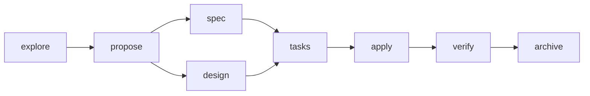
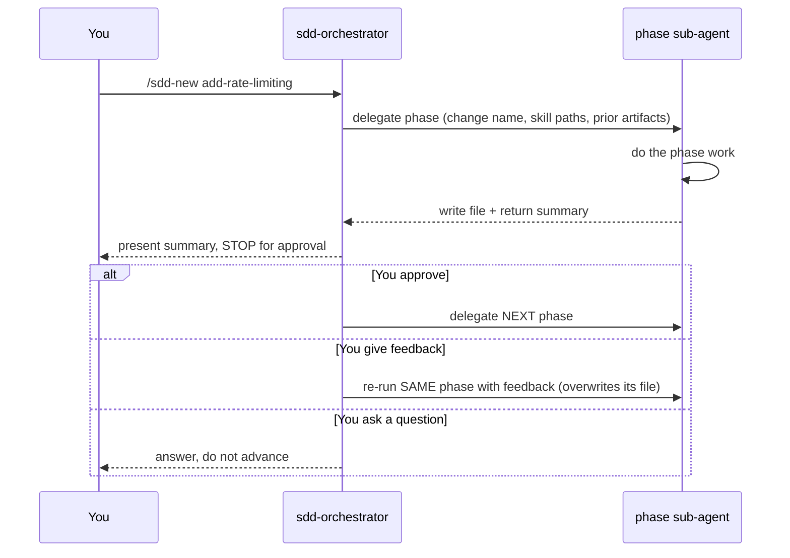
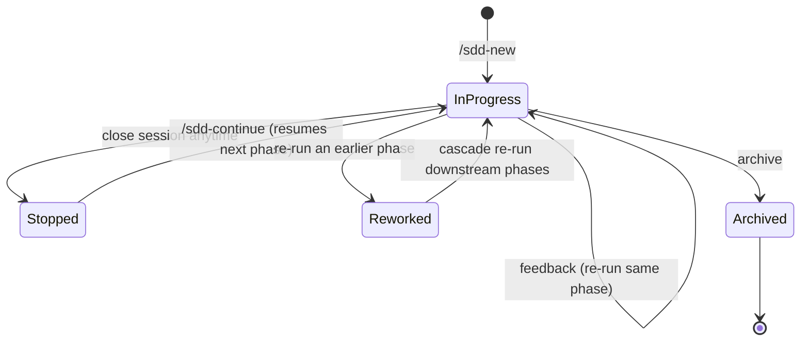

# The SDD Workflow — Example Usage

A worked example of running a change end to end, plus how to start, stop, resume, restart, and
rework any phase. This describes the current implementation exactly: **the files under
`openspec/changes/<change-name>/` are the entire state — there is no hidden database.**

For install/attach/detach, see [`usage.md`](usage.md).

---

## Starting a change & naming the output directory

You start with a slash command and a **kebab-case change name**. That name becomes the openspec
subdirectory holding every output file.

**OpenCode:**

```
/sdd-new add-rate-limiting
```

**Claude Code** (no slash trigger — ask the orchestrator directly):

```
use sdd to add rate limiting
```

The change name `add-rate-limiting` means all artifacts live in:

```
openspec/changes/add-rate-limiting/
├── exploration.md
├── proposal.md
├── spec.md
├── design.md
├── tasks.md
└── verify-report.md
```

Name rules: short, kebab-case (`^[a-z0-9]+(-[a-z0-9]+)*$`), describes the change. You pick it; the
orchestrator uses it verbatim as `{change-name}`.

Before phase 1, the orchestrator runs a one-time **Session Preflight**: resolves the workspace
root, confirms the change name, delegates `sdd-init` if `openspec/config.yaml` is missing, and reads
`.sdd-workflow/.skill-registry.md` so it can pass exact skill paths to sub-agents.

---

## The phase flow



`spec` and `design` both depend only on `propose`, so they may run in either order (or in
parallel). Everything else is strictly sequential.

Every phase follows the same loop: the orchestrator delegates to a focused sub-agent, the sub-agent
writes its file, the orchestrator shows you the summary, then **STOPS and waits for you**.



---

## What each phase does

| Phase | Description | Delegates to | Output file | Notes |
| --- | --- | --- | --- | --- |
| **explore** | Investigates the codebase before choosing an approach. | `sdd-explore` (read-only: cannot edit source) | `exploration.md` | Affected areas, constraints, approach comparison, recommendation. |
| **propose** | Formalizes intent, scope (in/out), and approach. May run a question round to surface business rules/edge cases. | `sdd-propose` | `proposal.md` | Reads `exploration.md` if present. |
| **spec** | Delta spec: what MUST be true after the change (requirements + Given/When/Then). WHAT, not HOW. | `sdd-spec` | `spec.md` (or `specs/{domain}/spec.md` for multi-domain) | Reads `proposal.md`. |
| **design** | Architecture, components, data flow, ADR-style decisions. | `sdd-design` | `design.md` | Reads `proposal.md`. |
| **tasks** | Ordered, shippable tasks linked to spec requirements. | `sdd-tasks` | `tasks.md` (`- [ ]` checkboxes) | Reads `spec.md` + `design.md`. |
| **apply** | Implements the tasks, following existing patterns. | `sdd-apply` (full tools incl. bash) | **code changes** + `tasks.md` updated with `- [x]` | RED→GREEN→REFACTOR only if `strict_tdd: true` in `openspec/config.yaml` (default off). Resumable. |
| **verify** | Runs tests/build, checks each requirement, flags CRITICAL/WARNING/SUGGESTION. | `sdd-verify` (read + bash, **cannot edit** source) | `verify-report.md` | Archive is blocked if unresolved CRITICALs exist. |
| **archive** | Merges the delta spec into `openspec/specs/`, moves the folder to `openspec/changes/archive/YYYY-MM-DD-<name>/`, writes the report. | `sdd-archive` | archived folder + `archive-report.md` | Terminal. |

Small requests never enter this flow — the orchestrator just does them inline. Say "use sdd" when
you explicitly want the structured process.

---

## Approval vs. feedback at each gate

The gate is **prompt-driven**, not a hardcoded state machine, so what you say determines what
happens:

| You respond with… | What happens |
| --- | --- |
| **Approval** — "looks good", "continue", "next", "approved", "sí, seguí" | Orchestrator launches the **next** phase. |
| **Feedback** — "scope is too broad, drop X", "add an edge case for empty input" | Orchestrator **re-runs the same phase** with your feedback, **overwriting the same file** in place. Iterates until you approve. Does NOT advance. |
| **A question** — "why approach B?" | Answers without advancing or rewriting. You then approve or give feedback. |

**To agree and continue:** say so in plain language — "continue" / "approve" / "next". No special
token is required.

> Caveat: because gates are instruction-driven, a mixed phrase like *"ok but also consider X"* is
> ambiguous — it may be read as feedback OR approval. For zero ambiguity, give feedback on one turn
> and approve on the next.

---

## Commands reference

| Command | What it does |
| --- | --- |
| `/sdd-new <name>` | Start a change: explore, then propose (with approval gates). |
| `/sdd-continue [name]` | Run the next phase in the dependency chain. |
| `/sdd-status [name]` | Read-only: show which artifacts exist and the next recommended phase. |
| `/sdd-ff <name>` | Fast-forward the planning phases (propose → tasks). Stops before apply. |

In Claude Code, phrase these as requests to the `sdd-orchestrator` (e.g. "continue the SDD change
add-rate-limiting").

---

## Stop, resume, restart, rework

Because **the files ARE the state**, all of these reduce to "which files exist."



### Resume where you left off

```
/sdd-continue add-rate-limiting
```

`sdd-continue` inspects which artifacts exist and runs the **first phase whose inputs exist but
whose own output doesn't** (for apply, it advances to verify once all tasks are `- [x]`). It does
**not** touch existing files — nothing is overwritten.

Check state anytime (no changes made):

```
/sdd-status add-rate-limiting
```

### Stop mid-phase

Just end the session. Planning phases either finished their file or didn't (so `sdd-continue` re-runs
that phase). `apply` is special: it marks each finished task `- [x]` and leaves the rest `- [ ]`,
so resuming skips completed tasks and continues the remaining ones.

### Restart / redo an earlier phase (rework)

There is no dedicated rework command yet. Do it by asking the orchestrator to re-run the phase:

```
re-run sdd-spec for add-rate-limiting — the requirements missed the burst case:
a client sending 100 requests in 1s must get 429 after the 10th within the window.
```

- The phase **overwrites its own file** (`spec.md`) — expected.
- **Downstream files are NOT auto-invalidated.** If you redo `spec`, then `design`/`tasks` may no
  longer match. You must redo the downstream phases too. The reliable way is to ask for the cascade
  explicitly:

```
re-run sdd-spec with that change, then re-run sdd-design and sdd-tasks to match.
```

> ⚠️ This is the one place you must think for yourself: nothing enforces cascade invalidation. When
> in doubt, `/sdd-status` shows which artifacts exist, and `git diff` shows what changed.

---

## Real-world scenarios

### "I stopped in apply, tasks half-done"

`apply` already marked completed tasks `- [x]`. Just resume:

```
/sdd-continue add-rate-limiting
```

`sdd-apply` reads `tasks.md`, skips the `[x]` tasks, and continues the `[ ]` ones. Stop/resume as
often as you like.

### "I need info from a teammate before I can finish"

| Situation | Best move |
| --- | --- |
| Blocked during **planning** (explore→tasks), waiting on a product decision | Keep the artifacts written so far and stop. The `.md` files persist. When the answer arrives, `/sdd-continue`, or rework the affected phase. |
| Blocked mid-**apply**, waiting on e.g. an API contract | Let apply mark done tasks `[x]` and stop. Commit the partial work if you want. Later `/sdd-continue` resumes the remaining `[ ]` tasks. |
| The answer **invalidates an earlier decision** | Rework from the earliest affected phase (re-run `spec`), then cascade re-run `design`/`tasks`. Artifacts are versioned in git, so you can `git diff` old vs new. |
| You want to **hand the change to a teammate** | The whole `openspec/changes/add-rate-limiting/` folder is self-describing. Commit it, they pull, and run `/sdd-continue add-rate-limiting`. Cross-machine handoff works because there is no external state. |

### "Multiple changes in flight at once"

Each change is its own folder under `openspec/changes/`. Pass the name explicitly so the orchestrator
never guesses:

```
/sdd-status                     # lists active changes if ambiguous
/sdd-continue add-rate-limiting
/sdd-continue fix-login-redirect
```

If you run `/sdd-continue` with no name and more than one active change exists, the orchestrator
asks you to choose and stops.

---

## Mental model in one line

Start with `/sdd-new`, approve or give feedback at each gate, resume with `/sdd-continue`, inspect
with `/sdd-status`, and rework by re-running a phase (remembering to cascade downstream). The files
in `openspec/changes/<name>/` are the single source of truth — copy them, commit them, diff them,
hand them off.
